# Mapeo de Funcionalidades y Requerimientos Funcionales (RF)
## Módulo Retail (Canal para el Vendedor de Mostrador) — Marketplace Deportivo

Este documento establece la **matriz maestra de orden y trazabilidad** del Módulo Retail, vinculando las **7 funcionalidades macro del sistema** con sus **19 Requerimientos Funcionales atómicos (RF-01 al RF-19)** y sus especificaciones formales bajo la metodología **Spec-Driven Development (SDD)**.

---

### Metadatos del Proyecto
* **Institución:** Universidad Nacional Mayor de San Marcos (UNMSM)
* **Facultad:** Facultad de Ingeniería de Sistemas e Informática
* **Asignatura:** Taller de Construcción de Software Web (Ciclo 2026 – II)
* **Módulo:** Canal Retail (Venta asistida presencial en mostrador)
* **Equipo de Trabajo:**
  * **Kevin** — *Frontend / UX*
  * **Guillermo** — *QA / Control de Calidad*
  * **Mihael** — *Product Owner (PO)*
  * **Miguel** — *DevOps / Tech Lead*
  * **Cristhian** — *Backend Developer*
  * **Maye** — *Arquitectura de Software*

---

## 1. Diagrama de Mapeo Jerárquico

```mermaid
graph TD
    classDef func fill:#1e293b,stroke:#3b82f6,stroke-width:2px,color:#fff;
    classDef rf fill:#0f172a,stroke:#10b981,stroke-width:1.5px,color:#e2e8f0;

    subgraph F1["F1: Inicio de Sesión del Vendedor (Miguel)"]
        class F1 func;
        RF01["RF-01: Autenticación de Personal"]
        RF02["RF-02: Control de Acceso RBAC"]
        RF03["RF-03: Gestión de Sesión Segura"]
        class RF01,RF02,RF03 rf;
    end

    subgraph F2["F2: Catálogo y Disponibilidad (Kevin)"]
        class F2 func;
        RF04["RF-04: Búsqueda Multicriterio"]
        RF05["RF-05: Matriz de Tallas y Colores"]
        RF06["RF-06: Stock Distribuido en Tiempo Real"]
        class RF04,RF05,RF06 rf;
    end

    subgraph F3["F3: Búsqueda y Registro de Clientes (Guillermo)"]
        class F3 func;
        RF07["RF-07: Búsqueda por Documento"]
        RF08["RF-08: Modal de Alta Rápida"]
        RF09["RF-09: Validación de Identificación"]
        class RF07,RF08,RF09 rf;
    end

    subgraph F4["F4: Venta Asistida y Promociones (Mihael)"]
        class F4 func;
        RF10["RF-10: Gestión de Carrito POS"]
        RF11["RF-11: Descuentos y Promociones"]
        RF12["RF-12: Totales, Descuento e Impuestos"]
        class RF10,RF11,RF12 rf;
    end

    subgraph F5["F5: Pedido, Pago y Boleta (Miguel)"]
        class F5 func;
        RF13["RF-13: Medios de Pago Presencial"]
        RF14["RF-14: Creación de Orden Transaccional"]
        RF15["RF-15: Comprobante Boleta/Factura"]
        class RF13,RF14,RF15 rf;
    end

    subgraph F6["F6: Consulta y Seguimiento (Cristhian)"]
        class F6 func;
        RF16["RF-16: Búsqueda Histórica de Órdenes"]
        RF17["RF-17: Estados y Trazabilidad"]
        class RF16,RF17 rf;
    end

    subgraph F7["F7: Entrega en Tienda / Pickup (Maye)"]
        class F7 func;
        RF18["RF-18: Verificación de Retiro en Tienda"]
        RF19["RF-19: Confirmación de Entrega Física"]
        class RF18,RF19 rf;
    end
```

---

## 2. Matriz Maestra de Trazabilidad: Funcionalidades vs Requisitos Funcionales

| Funcionalidad Macro | Cód. RF | Nombre del Requisito Funcional | Responsable | Prioridad | Regla de Negocio | Archivo de Especificación SDD |
| :--- | :--- | :--- | :--- | :--- | :--- | :--- |
| **F1: Inicio de Sesión del Vendedor** | **RF-01** | Autenticación de Personal de Tienda | Miguel | Must have | RN-03 | [rf-01-autenticacion-personal.spec.md](./specs/rf-01-autenticacion-personal.spec.md) |
| | **RF-02** | Control de Acceso por Roles (RBAC) | Miguel | Must have | RN-03 | [rf-02-control-acceso-rbac.spec.md](./specs/rf-02-control-acceso-rbac.spec.md) |
| | **RF-03** | Gestión y Persistencia de Sesión Segura | Miguel | Must have | RN-03 | [rf-03-persistencia-sesion-segura.spec.md](./specs/rf-03-persistencia-sesion-segura.spec.md) |
| **F2: Consulta de Catálogo y Disponibilidad** | **RF-04** | Búsqueda Multicriterio de Artículos | Kevin | Must have | RNF-01 | [rf-04-busqueda-multicriterio.spec.md](./specs/rf-04-busqueda-multicriterio.spec.md) |
| | **RF-05** | Visualización de Variantes (Talla/Color) | Kevin | Must have | RNF-05 | [rf-05-visualizacion-variantes.spec.md](./specs/rf-05-visualizacion-variantes.spec.md) |
| | **RF-06** | Consulta de Stock Distribuido en Tiempo Real | Kevin | Must have | RN-02 | [rf-06-stock-distribuido.spec.md](./specs/rf-06-stock-distribuido.spec.md) |
| **F3: Búsqueda y Registro Rápido de Clientes** | **RF-07** | Búsqueda de Cliente por Documento | Guillermo | Must have | RN-01 | [rf-07-busqueda-cliente-documento.spec.md](./specs/rf-07-busqueda-cliente-documento.spec.md) |
| | **RF-08** | Alta Rápida de Cliente en Mostrador | Guillermo | Must have | RN-01 | [rf-08-alta-rapida-cliente.spec.md](./specs/rf-08-alta-rapida-cliente.spec.md) |
| | **RF-09** | Validación Estricta de Formatos (DNI/RUC) | Guillermo | Should have | RN-01 | [rf-09-validacion-formatos-identificacion.spec.md](./specs/rf-09-validacion-formatos-identificacion.spec.md) |
| **F4: Venta Asistida y Promociones** | **RF-10** | Gestión del Carrito POS en Mostrador | Mihael | Must have | RN-02 | [rf-10-gestion-carrito-pos.spec.md](./specs/rf-10-gestion-carrito-pos.spec.md) |
| | **RF-11** | Aplicación Dinámica de Descuentos y Promociones | Mihael | Must have | RN-04 | [rf-11-aplicacion-descuentos-promociones.spec.md](./specs/rf-11-aplicacion-descuentos-promociones.spec.md) |
| | **RF-12** | Cálculo Consolidado de Totales e Impuestos | Mihael | Must have | RN-01 | [rf-12-calculo-totales-impuestos.spec.md](./specs/rf-12-calculo-totales-impuestos.spec.md) |
| **F5: Pedido, Pago y Emisión de Boleta** | **RF-13** | Registro de Medios de Pago Presencial | Miguel | Must have | RN-03 | [rf-13-registro-medios-pago.spec.md](./specs/rf-13-registro-medios-pago.spec.md) |
| | **RF-14** | Creación Oficial de la Orden Transaccional | Miguel | Must have | RN-02, RN-03 | [rf-14-creacion-orden-transaccional.spec.md](./specs/rf-14-creacion-orden-transaccional.spec.md) |
| | **RF-15** | Emisión y Despliegue de Comprobante Electrónico | Miguel | Must have | RN-01 | [rf-15-emision-comprobante-pago.spec.md](./specs/rf-15-emision-comprobante-pago.spec.md) |
| **F6: Consulta y Seguimiento de Pedidos** | **RF-16** | Búsqueda Histórica de Órdenes de Clientes | Cristhian | Should have | RN-03 | [rf-16-busqueda-historica-pedidos.spec.md](./specs/rf-16-busqueda-historica-pedidos.spec.md) |
| | **RF-17** | Visualización de Estados y Trazabilidad | Cristhian | Should have | RN-03 | [rf-17-visualizacion-estados-trazabilidad.spec.md](./specs/rf-17-visualizacion-estados-trazabilidad.spec.md) |
| **F7: Entrega en Tienda Física (Pickup)** | **RF-18** | Verificación y Validación de Retiro en Tienda | Maye | Must have | RN-03, RN-05 | [rf-18-verificacion-retiro-tienda.spec.md](./specs/rf-18-verificacion-retiro-tienda.spec.md) |
| | **RF-19** | Registro de Confirmación de Entrega Física | Maye | Must have | RN-03, RN-05 | [rf-19-confirmacion-entrega-fisica.spec.md](./specs/rf-19-confirmacion-entrega-fisica.spec.md) |

---

## 3. Detalle Operativo por Funcionalidad

### F1: Inicio de Sesión del Vendedor
* **Propósito:** Brindar acceso autenticado, controlado y auditable al personal de mostrador antes de permitir cualquier operación en la terminal de retail.
* **Flujo Operativo:** El vendedor ingresa su correo y contraseña ([RF-01](./specs/rf-01-autenticacion-personal.spec.md)); el sistema verifica que pertenezca a los roles permitidos `vendedor` o `cajero` ([RF-02](./specs/rf-02-control-acceso-rbac.spec.md)); y se almacena el token JWT de forma segura inyectándolo en cada petición durante el turno laboral de hasta 8 horas ([RF-03](./specs/rf-03-persistencia-sesion-segura.spec.md)).

### F2: Consulta del Catálogo y Disponibilidad de Productos
* **Propósito:** Permitir una exploración ágil e inmediata de prendas, calzado y accesorios deportivos con certeza de stock.
* **Flujo Operativo:** Búsqueda rápida por texto, lector de código de barras o chips por disciplina deportiva ([RF-04](./specs/rf-04-busqueda-multicriterio.spec.md)); apertura de la matriz ergonómica de variantes por tallas y colores ([RF-05](./specs/rf-05-visualizacion-variantes.spec.md)); y consulta en tiempo real con semáforo de inventario local vs almacén central ([RF-06](./specs/rf-06-stock-distribuido.spec.md)).

### F3: Búsqueda y Registro Rápido de Clientes
* **Propósito:** Identificar al comprador en mostrador sin detener la fila y sin perder los artículos agregados en el carrito.
* **Flujo Operativo:** Consulta por DNI o RUC con autocompletado en un segundo ([RF-07](./specs/rf-07-busqueda-cliente-documento.spec.md)); despliegue de modal simplificado ante cliente nuevo ([RF-08](./specs/rf-08-alta-rapida-cliente.spec.md)); y validación estricta de 8 dígitos para DNI y 11 para RUC ([RF-09](./specs/rf-09-validacion-formatos-identificacion.spec.md)).

### F4: Registro de Venta Asistida y Aplicación de Promociones
* **Propósito:** Armar la orden asistida asegurando el cumplimiento de existencias físicas y la transparencia de las promociones.
* **Flujo Operativo:** Panel lateral permanente del carrito POS con control de tope por stock local ([RF-10](./specs/rf-10-gestion-carrito-pos.spec.md)); evaluación de ofertas automáticas y cupones comerciales con el motor de promociones ([RF-11](./specs/rf-11-aplicacion-descuentos-promociones.spec.md)); y cálculo exacto de subtotales, descuentos, IGV (18%) e importe neto a pagar ([RF-12](./specs/rf-12-calculo-totales-impuestos.spec.md)).

### F5: Generación de Pedido, Pago en Tienda y Creación de Boleta
* **Propósito:** Procesar el cierre financiero, coordinar la reserva de stock y emitir el comprobante legal de pago.
* **Flujo Operativo:** Captura de pago en efectivo (con cálculo de vuelto) o tarjeta (con voucher de referencia) ([RF-13](./specs/rf-13-registro-medios-pago.spec.md)); decremento definitivo de stock en inventario y persistencia de orden en ventas con canal `"RETAIL"` ([RF-14](./specs/rf-14-creacion-orden-transaccional.spec.md)); y emisión de Boleta o Factura con formato de ticket térmico e impresión directa ([RF-15](./specs/rf-15-emision-comprobante-pago.spec.md)).

### F6: Consulta y Seguimiento de Pedidos del Cliente
* **Propósito:** Atender consultas de clientes en mostrador sobre el progreso de sus compras realizadas en cualquier canal.
* **Flujo Operativo:** Buscador multicanal por código de pedido o documento ([RF-16](./specs/rf-16-busqueda-historica-pedidos.spec.md)); y línea de tiempo visual con los hitos de preparación, arribo a tienda o entrega ([RF-17](./specs/rf-17-visualizacion-estados-trazabilidad.spec.md)).

### F7: Entrega del Producto en Tienda Física / Pickup
* **Propósito:** Garantizar que los paquetes retirados en mostrador se entreguen a la persona correcta con constancia fehaciente.
* **Flujo Operativo:** Bandeja de pedidos de la tienda en estado `LISTO_PARA_RECOJO` ([RF-18](./specs/rf-18-verificacion-retiro-tienda.spec.md)); y modal de confirmación con datos de quien recoge (titular o tercero) y checklist de entrega física ([RF-19](./specs/rf-19-confirmacion-entrega-fisica.spec.md)).

---

## 4. Contratos de API Centralizados
Los contratos JSON formales de los endpoints consumidos por estas 19 especificaciones se encuentran centralizados en:
* [specs/api-contracts.md](./specs/api-contracts.md)
