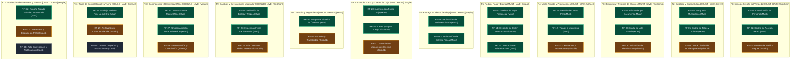

# Mapeo de Funcionalidades y Requerimientos Funcionales (RF)
## Módulo Retail (Canal para el Vendedor de Mostrador) — Marketplace Deportivo

Este documento establece la **matriz maestra de orden y trazabilidad** del Módulo Retail, vinculando las **12 funcionalidades macro del sistema** con sus **34 Requerimientos Funcionales atómicos (RF-01 al RF-34)** y sus especificaciones formales bajo la metodología **Spec-Driven Development (SDD)**.

---

### Metadatos del Proyecto
* **Institución:** Universidad Nacional Mayor de San Marcos (UNMSM)
* **Facultad:** Facultad de Ingeniería de Sistemas e Informática
* **Asignatura:** Taller de Construcción de Software Web (Ciclo 2026 – II)
* **Módulo:** Canal Retail (Venta asistida presencial en mostrador)
* **Equipo de Trabajo:**
  * **Mihael** — *Product Owner (PO)*
  * **Miguel** — *DevOps / Tech Lead*
  * **Kevin** — *Frontend / UX*
  * **Cristhian** — *Backend Developer*
  * **Maylle** — *Arquitectura de Software*
  * **Guillermo** — *QA / Control de Calidad*
  * **Angie** — *DBA (Database Administrator)*

---

### Criterio de Categorización MoSCoW en Dos Niveles

Para una gestión ágil del alcance del proyecto, la priorización se estructura bajo un **doble filtro jerárquico MoSCoW**:

1. **Filtro 1 — Nivel Macro (Funcionalidad):** Determina qué módulos o capacidades completas son críticas para el producto mínimo viable (MVP) de tienda física:
   * **Must Have (7 funcionalidades):** Imprescindibles para que el punto de venta (POS) pueda abrir turno, atender clientes, cobrar y entregar pedidos.
   * **Should Have (3 funcionalidades):** Capacidades operativas secundarias (seguimiento histórico, postventa/cambios, resiliencia offline).
   * **Could Have (2 funcionalidades):** Extensiones y paneles de soporte operativo (torre de control y gestión formal de mermas).

2. **Filtro 2 — Nivel Micro (Requerimiento Funcional):** Prioriza los requerimientos dentro de cada funcionalidad:
   * En una funcionalidad **Must Have**, sus RFs clasificados como *Must Have* constituyen el núcleo obligatorio de desarrollo, mientras que los *Should Have* representan enriquecimientos funcionales.
   * En una funcionalidad **Should Have** o **Could Have**, sus RFs internos se evalúan de forma condicionada: los RFs marcados como *Must Have* representan el núcleo que se activará **únicamente si se decide implementar dicha funcionalidad en el sprint/hito**.

---

## 1. Diagrama de Mapeo Jerárquico

```mermaid
graph TD
    classDef mustFunc fill:#1e3a8a,stroke:#3b82f6,stroke-width:2px,color:#fff;
    classDef shouldFunc fill:#854d0e,stroke:#eab308,stroke-width:2px,color:#fff;
    classDef couldFunc fill:#374151,stroke:#9ca3af,stroke-width:2px,color:#fff;
    classDef rfMust fill:#064e3b,stroke:#10b981,stroke-width:1.5px,color:#e2e8f0;
    classDef rfShould fill:#713f12,stroke:#f59e0b,stroke-width:1.5px,color:#e2e8f0;
    classDef rfCould fill:#1f2937,stroke:#6b7280,stroke-width:1.5px,color:#e2e8f0;

    subgraph F1["F1: Inicio de Sesión del Vendedor [MUST HAVE] (Cristhian)"]
        class F1 mustFunc;
        RF01["RF-01: Autenticación de Personal (Must)"]
        RF02["RF-02: Control de Acceso RBAC (Must)"]
        RF03["RF-03: Gestión de Sesión Segura (Should)"]
        class RF01,RF02 rfMust;
        class RF03 rfShould;
    end

    subgraph F2["F2: Catálogo y Disponibilidad [MUST HAVE] (Kevin)"]
        class F2 mustFunc;
        RF04["RF-04: Búsqueda Multicriterio (Must)"]
        RF05["RF-05: Matriz de Tallas y Colores (Must)"]
        RF06["RF-06: Stock Distribuido en Tiempo Real (Should)"]
        class RF04,RF05 rfMust;
        class RF06 rfShould;
    end

    subgraph F3["F3: Búsqueda y Registro de Clientes [MUST HAVE] (Guillermo)"]
        class F3 mustFunc;
        RF07["RF-07: Búsqueda por Documento (Must)"]
        RF08["RF-08: Modal de Alta Rápida (Must)"]
        RF09["RF-09: Validación de Identificación (Should)"]
        class RF07,RF08 rfMust;
        class RF09 rfShould;
    end

    subgraph F4["F4: Venta Asistida y Promociones [MUST HAVE] (Mihael)"]
        class F4 mustFunc;
        RF10["RF-10: Gestión de Carrito POS (Must)"]
        RF12["RF-12: Totales e Impuestos (Must)"]
        RF11["RF-11: Descuentos y Promociones (Should)"]
        class RF10,RF12 rfMust;
        class RF11 rfShould;
    end

    subgraph F5["F5: Pedido, Pago y Boleta [MUST HAVE] (Miguel)"]
        class F5 mustFunc;
        RF13["RF-13: Medios de Pago Presencial (Must)"]
        RF14["RF-14: Creación de Orden Transaccional (Must)"]
        RF15["RF-15: Comprobante Boleta/Factura (Must)"]
        class RF13,RF14,RF15 rfMust;
    end

    subgraph F7["F7: Entrega en Tienda / Pickup [MUST HAVE] (Maylle)"]
        class F7 mustFunc;
        RF18["RF-18: Verificación de Retiro en Tienda (Must)"]
        RF19["RF-19: Confirmación de Entrega Física (Must)"]
        class RF18,RF19 rfMust;
    end

    subgraph F8["F8: Control de Turno y Cuadre de Caja [MUST HAVE] (Angie)"]
        class F8 mustFunc;
        RF20["RF-20: Apertura con Fondo Fijo (Must)"]
        RF22["RF-22: Cierre y Arqueo Ciego X/Z (Must)"]
        RF21["RF-21: Movimientos Menores de Efectivo (Should)"]
        class RF20,RF22 rfMust;
        class RF21 rfShould;
    end

    subgraph F6["F6: Consulta y Seguimiento [SHOULD HAVE] (Kevin)"]
        class F6 shouldFunc;
        RF16["RF-16: Búsqueda Histórica de Órdenes (Must)"]
        RF17["RF-17: Estados y Trazabilidad (Should)"]
        class RF16 rfMust;
        class RF17 rfShould;
    end

    subgraph F9["F9: Cambios y Devoluciones Mostrador [SHOULD HAVE] (Cristhian)"]
        class F9 shouldFunc;
        RF23["RF-23: Validación de Boleta y Plazos (Must)"]
        RF24["RF-24: Inspección Física de la Prenda (Must)"]
        RF25["RF-25: Vale / Nota de Crédito Presencial (Should)"]
        class RF23,RF24 rfMust;
        class RF25 rfShould;
    end

    subgraph F10["F10: Contingencia y Resiliencia Offline [SHOULD HAVE] (Miguel)"]
        class F10 shouldFunc;
        RF26["RF-26: Conmutación a Modo Offline (Must)"]
        RF27["RF-27: Almacenamiento Local IndexedDB (Must)"]
        RF28["RF-28: Sincronización y Conciliación (Should)"]
        class RF26,RF27 rfMust;
        class RF28 rfShould;
    end

    subgraph F11["F11: Torre de Control Operativa Turno [COULD HAVE] (Mihael)"]
        class F11 couldFunc;
        RF30["RF-30: Bandeja Pedidos Pick-Up del Día (Must)"]
        RF29["RF-29: Alertas Stock Crítico en Tienda (Should)"]
        RF31["RF-31: Tablón Campañas y Promociones (Could)"]
        class RF30 rfMust;
        class RF29 rfShould;
        class RF31 rfCould;
    end

    subgraph F12["F12: Incidencias de Inventario y Mermas [COULD HAVE] (Maylle)"]
        class F12 couldFunc;
        RF32["RF-32: Reporte Prenda Dañada / No Ubicada (Must)"]
        RF33["RF-33: Cuarentena y Bloqueo en POS (Should)"]
        RF34["RF-34: Acta Discrepancia y Notificación (Could)"]
        class RF32 rfMust;
        class RF33 rfShould;
        class RF34 rfCould;
    end
```

---

## 2. Matriz Maestra de Trazabilidad: Funcionalidades vs Requisitos Funcionales

| Funcionalidad Macro (Filtro 1) | Cód. RF | Nombre del Requisito Funcional | Responsable | Prioridad Interna (Filtro 2) | Condición de Activación | Regla de Negocio | Archivo de Especificación SDD |
| :--- | :--- | :--- | :--- | :--- | :--- | :--- | :--- |
| **F1: Inicio de Sesión del Vendedor** `[MUST HAVE]` | **RF-01** | Autenticación de Personal de Tienda | Cristhian | **Must have** | Requerido en MVP base | RN-03 | [f01-autenticacion.md#rf-01](./specs/f01-autenticacion-personal/f01-autenticacion.md#rf-01) |
| | **RF-02** | Control de Acceso por Roles (RBAC) | Cristhian | **Must have** | Requerido en MVP base | RN-03 | [f01-autenticacion.md#rf-02](./specs/f01-autenticacion-personal/f01-autenticacion.md#rf-02) |
| | **RF-03** | Gestión y Persistencia de Sesión Segura | Cristhian | **Should have** | Secundario en MVP | RN-03 | [f01-autenticacion.md#rf-03](./specs/f01-autenticacion-personal/f01-autenticacion.md#rf-03) |
| **F2: Consulta de Catálogo y Disponibilidad** `[MUST HAVE]` | **RF-04** | Búsqueda Multicriterio de Artículos *(lector/SKU)* | Kevin | **Must have** | Requerido en MVP base | RNF-01 | [f02-catalogo.md#rf-04](./specs/f02-catalogo-productos/f02-catalogo.md#rf-04) |
| | **RF-05** | Visualización de Variantes (Talla/Color) | Kevin | **Must have** | Requerido en MVP base | RNF-05 | [f02-catalogo.md#rf-05](./specs/f02-catalogo-productos/f02-catalogo.md#rf-05) |
| | **RF-06** | Consulta de Stock Distribuido en Tiempo Real | Kevin | **Should have** | Secundario en MVP | RN-02 | [f02-catalogo.md#rf-06](./specs/f02-catalogo-productos/f02-catalogo.md#rf-06) |
| **F3: Búsqueda y Registro Rápido de Clientes** `[MUST HAVE]` | **RF-07** | Búsqueda de Cliente por Documento (DNI/RUC) | Guillermo | **Must have** | Requerido en MVP base | RN-01 | [f03-clientes.md#rf-07](./specs/f03-gestion-clientes/f03-clientes.md#rf-07) |
| | **RF-08** | Alta Rápida de Cliente en Mostrador | Guillermo | **Must have** | Requerido en MVP base | RN-01 | [f03-clientes.md#rf-08](./specs/f03-gestion-clientes/f03-clientes.md#rf-08) |
| | **RF-09** | Validación Estricta de Formatos (DNI/RUC) | Guillermo | **Should have** | Secundario en MVP | RN-01 | [f03-clientes.md#rf-09](./specs/f03-gestion-clientes/f03-clientes.md#rf-09) |
| **F4: Venta Asistida y Promociones** `[MUST HAVE]` | **RF-10** | Gestión del Carrito POS *(soporte Carrito en Espera)* | Mihael | **Must have** | Requerido en MVP base | RN-02 | [f04-carrito.md#rf-10](./specs/f04-carrito-mostrador/f04-carrito.md#rf-10) |
| | **RF-12** | Cálculo Consolidado de Totales e Impuestos | Mihael | **Must have** | Requerido en MVP base | RN-01 | [f04-carrito.md#rf-12](./specs/f04-carrito-mostrador/f04-carrito.md#rf-12) |
| | **RF-11** | Aplicación Dinámica de Descuentos y Promociones | Mihael | **Should have** | Secundario en MVP | RN-04 | [f04-carrito.md#rf-11](./specs/f04-carrito-mostrador/f04-carrito.md#rf-11) |
| **F5: Pedido, Pago y Emisión de Boleta** `[MUST HAVE]` | **RF-13** | Registro de Medios de Pago Presencial *(Efectivo/POS)* | Miguel | **Must have** | Requerido en MVP base | RN-03 | [f05-orden-cobro.md#rf-13](./specs/f05-orden-cobro/f05-orden-cobro.md#rf-13) |
| | **RF-14** | Creación Oficial de la Orden Transaccional | Miguel | **Must have** | Requerido en MVP base | RN-02, RN-03 | [f05-orden-cobro.md#rf-14](./specs/f05-orden-cobro/f05-orden-cobro.md#rf-14) |
| | **RF-15** | Emisión de Comprobante *(Boleta, Factura, Ticket Regalo)* | Miguel | **Must have** | Requerido en MVP base | RN-01 | [f05-orden-cobro.md#rf-15](./specs/f05-orden-cobro/f05-orden-cobro.md#rf-15) |
| **F7: Entrega en Tienda Física (Pickup)** `[MUST HAVE]` | **RF-18** | Verificación y Validación de Retiro en Tienda | Maylle | **Must have** | Requerido en MVP base | RN-03, RN-05 | [f07-pickup.md#rf-18](./specs/f07-retiro-tienda-pickup/f07-pickup.md#rf-18) |
| | **RF-19** | Registro de Confirmación de Entrega Física | Maylle | **Must have** | Requerido en MVP base | RN-03, RN-05 | [f07-pickup.md#rf-19](./specs/f07-retiro-tienda-pickup/f07-pickup.md#rf-19) |
| **F8: Control de Turno y Cuadre de Caja** `[MUST HAVE]` | **RF-20** | Apertura de Turno con Fondo Fijo de Caja | Angie | **Must have** | Requerido en MVP base | RN-03 | [f08-caja-turnos.md#rf-20](./specs/f08-caja-turnos/f08-caja-turnos.md#rf-20) |
| | **RF-22** | Cierre de Turno y Arqueo Ciego de Caja (Reporte X/Z) | Angie | **Must have** | Requerido en MVP base | RN-03 | [f08-caja-turnos.md#rf-22](./specs/f08-caja-turnos/f08-caja-turnos.md#rf-22) |
| | **RF-21** | Registro de Movimientos Menores de Efectivo | Angie | **Should have** | Secundario en MVP | RN-03 | [f08-caja-turnos.md#rf-21](./specs/f08-caja-turnos/f08-caja-turnos.md#rf-21) |
| **F6: Consulta y Seguimiento de Pedidos** `[SHOULD HAVE]` | **RF-16** | Búsqueda Histórica de Órdenes de Clientes | Kevin | **Must have** | Activo si F6 entra al alcance | RN-03 | [f06-trazabilidad.md#rf-16](./specs/f06-trazabilidad-pedidos/f06-trazabilidad.md#rf-16) |
| | **RF-17** | Visualización de Estados y Trazabilidad | Kevin | **Should have** | Secundario si F6 entra | RN-03 | [f06-trazabilidad.md#rf-17](./specs/f06-trazabilidad-pedidos/f06-trazabilidad.md#rf-17) |
| **F9: Cambios y Devoluciones en Mostrador** `[SHOULD HAVE]` | **RF-23** | Validación de Comprobante y Plazos de Cambio | Cristhian | **Must have** | Activo si F9 entra al alcance | RN-01, RN-03 | [f09-devoluciones.md#rf-23](./specs/f09-devoluciones-cambios/f09-devoluciones.md#rf-23) |
| | **RF-24** | Inspección Física y Registro de Estado de Prenda | Cristhian | **Must have** | Activo si F9 entra al alcance | RN-05 | [f09-devoluciones.md#rf-24](./specs/f09-devoluciones-cambios/f09-devoluciones.md#rf-24) |
| | **RF-25** | Emisión de Vale / Nota de Crédito Presencial | Cristhian | **Should have** | Secundario si F9 entra | RN-01, RN-03 | [f09-devoluciones.md#rf-25](./specs/f09-devoluciones-cambios/f09-devoluciones.md#rf-25) |
| **F10: Modo de Contingencia y Resiliencia Offline** `[SHOULD HAVE]` | **RF-26** | Detección Automática y Conmutación a Modo Offline | Miguel | **Must have** | Activo si F10 entra al alcance | RNF-02 | [f10-contingencia-offline.md#rf-26](./specs/f10-contingencia-offline/f10-contingencia-offline.md#rf-26) |
| | **RF-27** | Almacenamiento Local Seguro en IndexedDB | Miguel | **Must have** | Activo si F10 entra al alcance | RNF-02, RN-03 | [f10-contingencia-offline.md#rf-27](./specs/f10-contingencia-offline/f10-contingencia-offline.md#rf-27) |
| | **RF-28** | Sincronización Diferida y Conciliación Automática | Miguel | **Should have** | Secundario si F10 entra | RN-02, RN-03 | [f10-contingencia-offline.md#rf-28](./specs/f10-contingencia-offline/f10-contingencia-offline.md#rf-28) |
| **F11: Torre de Control Operativa de Turno** `[COULD HAVE]` | **RF-30** | Bandeja de Pedidos Pick-Up del Día en Tienda | Mihael | **Must have** | Activo si F11 entra al alcance | RN-03, RN-05 | [f11-alertas.md#rf-30](./specs/f11-alertas-operativas/f11-alertas.md#rf-30) |
| | **RF-29** | Panel de Alertas de Stock Crítico y Quiebre en Tienda | Mihael | **Should have** | Secundario si F11 entra | RN-02 | [f11-alertas.md#rf-29](./specs/f11-alertas-operativas/f11-alertas.md#rf-29) |
| | **RF-31** | Tablón Informativo de Campañas y Promociones | Mihael | **Could have** | Opcional si F11 entra | RN-04 | [f11-alertas.md#rf-31](./specs/f11-alertas-operativas/f11-alertas.md#rf-31) |
| **F12: Gestión de Incidencias de Inventario y Mermas** `[COULD HAVE]` | **RF-32** | Reporte de Prenda Dañada o No Ubicada en Mostrador | Maylle | **Must have** | Activo si F12 entra al alcance | RN-02 | [f12-discrepancias.md#rf-32](./specs/f12-discrepancias-inventario/f12-discrepancias.md#rf-32) |
| | **RF-33** | Puesta en Cuarentena y Bloqueo Temporal en POS | Maylle | **Should have** | Secundario si F12 entra | RN-02 | [f12-discrepancias.md#rf-33](./specs/f12-discrepancias-inventario/f12-discrepancias.md#rf-33) |
| | **RF-34** | Acta de Discrepancia y Notificación a Inventarios | Maylle | **Could have** | Opcional si F12 entra | RN-02 | [f12-discrepancias.md#rf-34](./specs/f12-discrepancias-inventario/f12-discrepancias.md#rf-34) |

---

## 3. Resumen de Asignación por Integrante

| Integrante | Rol | Funcionalidad 1 (Principal) | Funcionalidad 2 (Secundaria / Opcional) | Total Funcionalidades |
| :--- | :--- | :--- | :--- | :---: |
| **Mihael** | *Product Owner (PO)* | **F4: Venta Asistida y Promociones** `[MUST HAVE]` | **F11: Torre de Control Operativa** `[COULD HAVE]` | 2 |
| **Miguel** | *DevOps / Tech Lead* | **F5: Pedido, Pago y Boleta** `[MUST HAVE]` | **F10: Contingencia y Resiliencia Offline** `[SHOULD HAVE]` | 2 |
| **Kevin** | *Frontend / UX* | **F2: Catálogo y Disponibilidad** `[MUST HAVE]` | **F6: Consulta y Seguimiento de Pedidos** `[SHOULD HAVE]` | 2 |
| **Cristhian** | *Backend Developer* | **F1: Inicio de Sesión del Vendedor** `[MUST HAVE]` | **F9: Cambios y Devoluciones** `[SHOULD HAVE]` | 2 |
| **Maylle** | *Arquitectura de Software* | **F7: Entrega en Tienda / Pickup** `[MUST HAVE]` | **F12: Incidencias y Mermas** `[COULD HAVE]` | 2 |
| **Guillermo** | *QA / Control de Calidad* | **F3: Búsqueda y Registro de Clientes** `[MUST HAVE]` | *(Sin segunda funcionalidad asignada)* | 1 |
| **Angie** | *DBA (Database Administrator)* | **F8: Control de Turno y Cuadre de Caja** `[MUST HAVE]` | *(Sin segunda funcionalidad asignada)* | 1 |

> [!NOTE]
> Todos los integrantes cuentan con al menos una funcionalidad clasificada como **MUST HAVE**. Cinco integrantes poseen una segunda funcionalidad asignada (Should Have o Could Have), mientras que dos integrantes (Guillermo y Angie) se concentran en una única funcionalidad crítica del MVP base.

---

## 4. Detalle Operativo por Funcionalidad

### F1: Inicio de Sesión del Vendedor `[MUST HAVE]`
* **Responsable:** Cristhian (Backend Developer)
* **Propósito:** Brindar acceso autenticado, controlado y auditable al personal de mostrador antes de permitir cualquier operación en la terminal de retail.
* **Flujo Operativo:** El vendedor ingresa sus credenciales ([RF-01](./specs/f01-autenticacion-personal/f01-autenticacion.md#rf-01)); el sistema verifica que pertenezca a los roles autorizados contra la base local ([RF-02](./specs/f01-autenticacion-personal/f01-autenticacion.md#rf-02)); y se gestiona la sesión segura durante la jornada laboral ([RF-03](./specs/f01-autenticacion-personal/f01-autenticacion.md#rf-03)).

### F2: Consulta del Catálogo y Disponibilidad de Productos `[MUST HAVE]`
* **Responsable:** Kevin (Frontend / UX)
* **Propósito:** Permitir una exploración ágil e inmediata de prendas, calzado y accesorios deportivos con certeza de stock.
* **Flujo Operativo:** Búsqueda rápida por texto o código de barras/SKU ([RF-04](./specs/f02-catalogo-productos/f02-catalogo.md#rf-04)); visualización de variantes de talla y color ([RF-05](./specs/f02-catalogo-productos/f02-catalogo.md#rf-05)); y semáforo de inventario local vs central ([RF-06](./specs/f02-catalogo-productos/f02-catalogo.md#rf-06)).

### F3: Búsqueda y Registro Rápido de Clientes `[MUST HAVE]`
* **Responsable:** Guillermo (QA / Control de Calidad)
* **Propósito:** Identificar al comprador en mostrador sin detener la fila y sin perder los artículos agregados en el carrito.
* **Flujo Operativo:** Búsqueda por DNI o RUC con autocompletado en un segundo ([RF-07](./specs/f03-gestion-clientes/f03-clientes.md#rf-07)); modal simplificado de alta rápida ante cliente no registrado ([RF-08](./specs/f03-gestion-clientes/f03-clientes.md#rf-08)); y validación estricta de formatos numéricos oficiales ([RF-09](./specs/f03-gestion-clientes/f03-clientes.md#rf-09)).

### F4: Registro de Venta Asistida y Promociones `[MUST HAVE]`
* **Responsable:** Mihael (Product Owner)
* **Propósito:** Armar la orden asistida asegurando el cumplimiento de existencias físicas, la agilidad en probadores y la transparencia de las promociones.
* **Flujo Operativo:** Gestión del carrito POS con soporte de Carrito en Espera ([RF-10](./specs/f04-carrito-mostrador/f04-carrito.md#rf-10)); cálculo de subtotales, impuestos y neto ([RF-12](./specs/f04-carrito-mostrador/f04-carrito.md#rf-12)); y evaluación de promociones y cupones comerciales ([RF-11](./specs/f04-carrito-mostrador/f04-carrito.md#rf-11)).

### F5: Generación de Pedido, Pago en Tienda y Creación de Boleta `[MUST HAVE]`
* **Responsable:** Miguel (DevOps / Tech Lead)
* **Propósito:** Procesar el cierre financiero, coordinar la reserva de stock y emitir el comprobante legal o de regalo.
* **Flujo Operativo:** Captura de pago presencial en efectivo o tarjeta POS ([RF-13](./specs/f05-orden-cobro/f05-orden-cobro.md#rf-13)); decremento definitivo de stock y creación transaccional de orden ([RF-14](./specs/f05-orden-cobro/f05-orden-cobro.md#rf-14)); y emisión de Boleta, Factura o Ticket de Regalo ([RF-15](./specs/f05-orden-cobro/f05-orden-cobro.md#rf-15)).

### F6: Consulta y Seguimiento de Pedidos del Cliente `[SHOULD HAVE]`
* **Responsable:** Kevin (Frontend / UX)
* **Propósito:** Atender consultas de clientes en mostrador sobre el progreso de sus compras realizadas en cualquier canal.
* **Flujo Operativo:** Buscador multicanal por código de pedido o documento ([RF-16](./specs/f06-trazabilidad-pedidos/f06-trazabilidad.md#rf-16)); y visualización visual del estado y trazabilidad del pedido ([RF-17](./specs/f06-trazabilidad-pedidos/f06-trazabilidad.md#rf-17)).

### F7: Entrega del Producto en Tienda Física / Pickup `[MUST HAVE]`
* **Responsable:** Maylle (Arquitectura de Software)
* **Propósito:** Garantizar que los paquetes retirados en mostrador se entreguen a la persona correcta con constancia fehaciente.
* **Flujo Operativo:** Bandeja de pedidos de la tienda en estado listo para recojo ([RF-18](./specs/f07-retiro-tienda-pickup/f07-pickup.md#rf-18)); y confirmación de entrega física con registro del titular o tercero ([RF-19](./specs/f07-retiro-tienda-pickup/f07-pickup.md#rf-19)).

### F8: Control de Turno y Cuadre de Caja `[MUST HAVE]`
* **Responsable:** Angie (DBA)
* **Propósito:** Gestionar el ciclo de vida del dinero en efectivo en la estación de trabajo física, asegurando el control del fondo inicial y la conciliación al cierre.
* **Flujo Operativo:** Apertura de turno con fondo fijo de sencillo ([RF-20](./specs/f08-caja-turnos/f08-caja-turnos.md#rf-20)); control de movimientos menores de efectivo ([RF-21](./specs/f08-caja-turnos/f08-caja-turnos.md#rf-21)); y cierre con arqueo ciego generando el reporte X/Z con cálculo de descuadre ([RF-22](./specs/f08-caja-turnos/f08-caja-turnos.md#rf-22)).

### F9: Gestión de Cambios y Devoluciones en Mostrador `[SHOULD HAVE]`
* **Responsable:** Cristhian (Backend Developer)
* **Propósito:** Atender solicitudes presenciales de clientes que requieren cambio de talla, modelo o devolución de prendas deportivas dentro del plazo reglamentario.
* **Flujo Operativo:** Validación del comprobante de compra y plazos vigentes ([RF-23](./specs/f09-devoluciones-cambios/f09-devoluciones.md#rf-23)); inspección física del estado de la prenda ([RF-24](./specs/f09-devoluciones-cambios/f09-devoluciones.md#rf-24)); y emisión de Vale de Compra / Nota de Crédito para canje inmediato ([RF-25](./specs/f09-devoluciones-cambios/f09-devoluciones.md#rf-25)).

### F10: Modo de Contingencia y Resiliencia Offline `[SHOULD HAVE]`
* **Responsable:** Miguel (DevOps / Tech Lead)
* **Propósito:** Asegurar la continuidad operativa de la terminal POS ante caídas de internet o fallas de red en la tienda física.
* **Flujo Operativo:** Detección de pérdida de conexión y conmutación a modo offline ([RF-26](./specs/f10-contingencia-offline/f10-contingencia.md#rf-26)); almacenamiento local seguro de transacciones en IndexedDB ([RF-27](./specs/f10-contingencia-offline/f10-contingencia.md#rf-27)); y resincronización diferida automática al restablecerse la red ([RF-28](./specs/f10-contingencia-offline/f10-contingencia.md#rf-28)).

### F11: Torre de Control Operativa de Turno `[COULD HAVE]`
* **Responsable:** Mihael (Product Owner)
* **Propósito:** Proveer una vista ejecutiva con información contextual del turno para optimizar la atención diaria.
* **Flujo Operativo:** Bandeja de pedidos pickup programados para el día ([RF-30](./specs/f11-alertas-operativas/f11-alertas.md#rf-30)); panel de alertas de stock crítico en mostrador ([RF-29](./specs/f11-alertas-operativas/f11-alertas.md#rf-29)); y tablón informativo de campañas y promociones vigentes ([RF-31](./specs/f11-alertas-operativas/f11-alertas.md#rf-31)).

### F12: Gestión de Incidencias de Inventario y Mermas en Tienda `[COULD HAVE]`
* **Responsable:** Maylle (Arquitectura de Software)
* **Propósito:** Registrar y aislar formalmente prendas o zapatillas deportivas dañadas o con discrepancias físicas en el mostrador.
* **Flujo Operativo:** Reporte de prenda dañada o no ubicada ([RF-32](./specs/f12-discrepancias-inventario/f12-discrepancias.md#rf-32)); aislamiento preventivo en cuarentena retirándolo de venta en POS ([RF-33](./specs/f12-discrepancias-inventario/f12-discrepancias.md#rf-33)); y emisión de acta digital de discrepancia hacia inventarios ([RF-34](./specs/f12-discrepancias-inventario/f12-discrepancias.md#rf-34)).

---

## 5. Contratos de API Centralizados
Los contratos JSON formales de los endpoints consumidos por estas especificaciones se encuentran centralizados en:
* [specs/generales/api-contracts.md](./specs/generales/api-contracts.md)

