# Diseño de Base de Datos — Módulo Retail (G4)
## Modelo Entidad-Relación y Diccionario de Datos (Hito 2)

**Proyecto:** Marketplace Multicanal de Artículos Deportivos  
**Canal:** Retail — Venta en Mostrador (Grupo 4)  
**Patrón Arquitectónico:** Database-per-Service (Microservicio desacoplado)  
**Motor Objetivo:** PostgreSQL 15+ / MySQL 8.0+  

---

## 1. Principio de Diseño y Aislamiento de Microservicio

En concordancia con el patrón **Database-per-Service**, el microservicio Retail posee su propio esquema de base de datos relacional independiente. 

> [!IMPORTANT]
> **Desacoplamiento de Entidades Foráneas:**  
> Los atributos `tienda_id`, `vendedor_id`, `cliente_id`, `producto_id`, `variante_sku_id` y `pedido_id_origen` son **identificadores lógicos desacoplados** (UUIDs provistos por los módulos de Seguridad, Productos o Ventas vía API REST). No se definen como `FOREIGN KEY` físicas a nivel de motor SQL hacia bases de datos externas, garantizando alta cohesión, autonomía de despliegue y tolerancia a fallos.

---

## 2. Diagrama Entidad-Relación (Mermaid)

El siguiente diagrama representa las **7 tablas del modelo de datos de Retail** y sus relaciones internas directas:

```mermaid
erDiagram
    RET_CAJA_SESION ||--o{ RET_MOVIMIENTO_CAJA : "1:N registra movimientos"
    RET_CARRITO_ESPERA ||--|{ RET_CARRITO_ESPERA_ITEM : "1:N contiene articulos"
    RET_CAJA_SESION ||--o{ RET_SOLICITUD_CAMBIO_MOSTRADOR : "1:N autoriza tramites"

    RET_CAJA_SESION {
        uuid id_sesion PK "Identificador unico de la sesion de caja"
        uuid tienda_id "ID de la sucursal fisica"
        string terminal_pos_codigo "Codigo identificador del hardware POS (ej: POS-01)"
        uuid vendedor_id "ID logico del cajero/vendedor responsable (Seguridad)"
        timestamp fecha_hora_apertura "Momento exacto de inicio de turno"
        decimal saldo_inicial_efectivo "Monto asignado como fondo fijo inicial"
        timestamp fecha_hora_cierre "Momento de finalizacion del turno"
        decimal saldo_final_declarado "Monto físico contado por cajero (Arqueo Ciego)"
        decimal saldo_final_sistema "Monto calculado por sistema según ventas y movimientos"
        decimal diferencia_saldo "Diferencia: declarado - sistema (sobrante/faltante)"
        string estado "ABIERTA, CERRADA, OBSERVADA"
        text observaciones_cierre "Comentarios ante descuadres o incidencias de turno"
        timestamp created_at "Auditoria de creacion"
        timestamp updated_at "Auditoria de actualizacion"
    }

    RET_MOVIMIENTO_CAJA {
        uuid id_movimiento PK "Identificador unico del movimiento menor"
        uuid caja_sesion_id FK "Referencia a la sesion de caja activa"
        string tipo_movimiento "INGRESO_MENOR, SALIDA_GASTO"
        decimal monto "Valor monetario de la transaccion menor"
        text motivo "Justificacion operativa (compra insumos, sencillo, etc.)"
        string autorizado_por_supervisor "Nombre/credencial del supervisor que aprobo"
        timestamp fecha_hora "Fecha y hora del registro"
    }

    RET_CARRITO_ESPERA {
        uuid id_carrito_espera PK "Identificador unico del carrito suspendido"
        uuid tienda_id "ID de la sucursal fisica"
        uuid vendedor_id "ID logico del vendedor que atiende (Seguridad)"
        uuid cliente_id "ID logico opcional del cliente identificado (Seguridad)"
        string alias_ticket "Nombre descriptivo para recuperacion rapida (ej: Probador 2)"
        decimal subtotal_estimado "Total calculado al momento de la suspension"
        timestamp fecha_creacion "Momento en que se guardo el carrito"
        timestamp fecha_expiracion_reserva "Tiempo limite antes de liberar el stock temporal"
        string estado "SUSPENDIDO, REANUDADO, EXPIRADO"
    }

    RET_CARRITO_ESPERA_ITEM {
        uuid id_item PK "Identificador unico del item en espera"
        uuid carrito_espera_id FK "Referencia al carrito en espera cabecera"
        uuid producto_id "ID logico del producto base (Productos)"
        uuid variante_sku_id "ID logico de la variante SKU concreta (Productos)"
        string nombre_producto "Cache legible del articulo congelado"
        string talla_color "Detalle visible de variante (ej: L / Negro)"
        int cantidad "Unidades seleccionadas por el cliente"
        decimal precio_unitario "Precio vigente al momento de suspender el carrito"
    }

    RET_SOLICITUD_CAMBIO_MOSTRADOR {
        uuid id_solicitud PK "Identificador de la solicitud de cambio"
        uuid caja_sesion_id FK "Sesion de caja donde se efectua el tramite"
        uuid pedido_id_origen "ID logico de la orden original (Ventas)"
        uuid variante_sku_devuelta_id "ID logico de la prenda que devuelve el cliente"
        uuid cliente_id "ID logico del cliente (Seguridad)"
        string motivo_cambio "CAMBIO_TALLA, DEFECTO_FABRICA, DISCONFORMIDAD"
        boolean inspeccion_etiquetas "Check: etiquetas y rotulado intactos"
        boolean inspeccion_sin_uso "Check: prenda limpia sin senales de uso corporal"
        boolean inspeccion_empaque "Check: caja o bolsa original presente"
        string estado_aprobacion "APROBADO_EN_TIENDA, RECHAZADO"
        string vale_temporal_codigo "Codigo del vale/nota de credito para canje inmediato"
        decimal monto_acreditado "Saldo a favor para seleccion de nueva prenda"
        timestamp fecha_inspeccion "Momento en que el vendedor valida la prenda"
    }

    RET_INCIDENCIA_INVENTARIO {
        uuid id_incidencia PK "Identificador unico de la incidencia"
        uuid tienda_id "ID de la sucursal fisica"
        uuid vendedor_reporta_id "ID logico del colaborador que detecta la merma"
        uuid variante_sku_id "ID logico de la prenda afectada (Productos)"
        string codigo_barras "EAN-13 o SKU escaneado de la prenda"
        string tipo_falla "MANCHADO_PROBADOR, COSTURA_ROTA, DESCOLORIDO, EXTRAVIO"
        text detalle_observacion "Explicacion circunstancial del dano o quiebre"
        string evidencia_foto_url "URL o path de fotografia de la prenda danada"
        string estado_cuarentena "EN_CUARENTENA, DERIVADO_ALMACEN, DESCARTADO, RECHAZADO"
        timestamp fecha_reporte "Fecha y hora del aislamiento preventivo"
    }

    RET_CONTINGENCIA_OFFLINE_LOG {
        uuid id_log PK "Identificador unico de la transaccion offline"
        uuid tienda_id "ID de la sucursal fisica"
        string terminal_pos_codigo "Terminal que emitio la venta sin conexion"
        string venta_local_uuid "UUID generado localmente en el navegador (IndexedDB)"
        text payload_json_orden "Payload transaccional completo en formato JSON"
        string firma_hash_seguridad "Hash SHA-256 de integridad para prevenir alteraciones"
        string estado_sincronizacion "PENDIENTE, RESINCRONIZADO, CONFLICTO"
        timestamp fecha_emision_offline "Momento en que se cobro al cliente offline"
        timestamp fecha_sincronizacion "Momento en que se resincronizo con el servidor central"
        text error_detalle "Trazabilidad del motivo de conflicto si fallo la subida"
    }
```



---

## 3. Diccionario de Datos Exhaustivo

### Tabla 1: `RET_CAJA_SESION`
Gestiona la apertura, turnos, fondo fijo inicial y el **arqueo ciego de caja (Cierre Z)** en el mostrador.

| Campo | Tipo SQL | Nulo | Restricciones / Valores | Descripción |
| :--- | :--- | :---: | :--- | :--- |
| `id_sesion` | `UUID` | No | `PRIMARY KEY` | Identificador de la sesión de caja |
| `tienda_id` | `UUID` | No | — | Identificador de la sucursal física |
| `terminal_pos_codigo` | `VARCHAR(20)` | No | — | Código físico de la máquina POS (ej. `POS-01`) |
| `vendedor_id` | `UUID` | No | Ref. externa Seguridad | Cajero o vendedor asignado |
| `fecha_hora_apertura` | `TIMESTAMP` | No | `DEFAULT CURRENT_TIMESTAMP` | Fecha y hora de apertura de turno |
| `saldo_inicial_efectivo`| `DECIMAL(12,2)` | No | `CHECK (saldo_inicial_efectivo >= 0)` | Fondo fijo de apertura (sencillo) |
| `fecha_hora_cierre` | `TIMESTAMP` | Sí | — | Fecha y hora en que se concluye el turno |
| `saldo_final_declarado`| `DECIMAL(12,2)` | Sí | — | Efectivo físico contado en arqueo ciego |
| `saldo_final_sistema` | `DECIMAL(12,2)` | Sí | — | Saldo calculado (Inicial + Ventas - Egresos) |
| `diferencia_saldo` | `DECIMAL(12,2)` | Sí | — | Saldo declarado menos saldo del sistema |
| `estado` | `VARCHAR(20)` | No | `CHECK IN ('ABIERTA', 'CERRADA', 'OBSERVADA')` | Estado del turno de caja |
| `observaciones_cierre` | `TEXT` | Sí | — | Explicación en caso de sobrante o faltante |
| `created_at` | `TIMESTAMP` | No | `DEFAULT CURRENT_TIMESTAMP` | Auditoría |
| `updated_at` | `TIMESTAMP` | No | `DEFAULT CURRENT_TIMESTAMP` | Auditoría |

---

### Tabla 2: `RET_MOVIMIENTO_CAJA`
Registra movimientos menores de efectivo durante el turno (compras de insumos urgentes, ingreso de sencillo auxiliar).

| Campo | Tipo SQL | Nulo | Restricciones / Valores | Descripción |
| :--- | :--- | :---: | :--- | :--- |
| `id_movimiento` | `UUID` | No | `PRIMARY KEY` | Identificador del movimiento de caja |
| `caja_sesion_id` | `UUID` | No | `FOREIGN KEY (RET_CAJA_SESION)` | Sesión de caja vinculada |
| `tipo_movimiento` | `VARCHAR(30)` | No | `CHECK IN ('INGRESO_MENOR', 'SALIDA_GASTO')` | Sentido del flujo de efectivo |
| `monto` | `DECIMAL(12,2)` | No | `CHECK (monto > 0)` | Monto dinerario del movimiento |
| `motivo` | `TEXT` | No | — | Justificación operativa del movimiento |
| `autorizado_por_supervisor` | `VARCHAR(100)` | No | — | Nombre o credencial del supervisor aprobador |
| `fecha_hora` | `TIMESTAMP` | No | `DEFAULT CURRENT_TIMESTAMP` | Momento exacto del registro |

---

### Tabla 3: `RET_CARRITO_ESPERA`
Permite suspender carritos activos para no retener la cola del POS mientras el cliente se prueba prendas en los probadores.

| Campo | Tipo SQL | Nulo | Restricciones / Valores | Descripción |
| :--- | :--- | :---: | :--- | :--- |
| `id_carrito_espera` | `UUID` | No | `PRIMARY KEY` | Identificador del carrito suspendido |
| `tienda_id` | `UUID` | No | — | Sucursal donde se origina la atención |
| `vendedor_id` | `UUID` | No | Ref. externa Seguridad | Vendedor que asistió al cliente |
| `cliente_id` | `UUID` | Sí | Ref. externa Seguridad | Cliente identificado (opcional) |
| `alias_ticket` | `VARCHAR(80)` | No | — | Alias visual (ej. `Probador 3 - Casaca Adidas`) |
| `subtotal_estimado` | `DECIMAL(12,2)` | No | `CHECK (subtotal_estimado >= 0)` | Monto preliminar del carrito congelado |
| `fecha_creacion` | `TIMESTAMP` | No | `DEFAULT CURRENT_TIMESTAMP` | Momento de la suspensión |
| `fecha_expiracion_reserva`| `TIMESTAMP` | No | — | Tiempo límite de retención antes de expiración |
| `estado` | `VARCHAR(20)` | No | `CHECK IN ('SUSPENDIDO', 'REANUDADO', 'EXPIRADO')` | Ciclo de vida del carrito en espera |

---

### Tabla 4: `RET_CARRITO_ESPERA_ITEM`
Detalle de artículos contenidos dentro de un carrito puesto en espera.

| Campo | Tipo SQL | Nulo | Restricciones / Valores | Descripción |
| :--- | :--- | :---: | :--- | :--- |
| `id_item` | `UUID` | No | `PRIMARY KEY` | Identificador del ítem en espera |
| `carrito_espera_id` | `UUID` | No | `FOREIGN KEY (RET_CARRITO_ESPERA)` | Carrito padre |
| `producto_id` | `UUID` | No | Ref. externa Productos | Identificador base del producto |
| `variante_sku_id` | `UUID` | No | Ref. externa Productos | SKU específico (talla y color) |
| `nombre_producto` | `VARCHAR(150)` | No | — | Snapshot del nombre del producto |
| `talla_color` | `VARCHAR(50)` | No | — | Resumen de variante (ej. `M / Azul Marino`) |
| `cantidad` | `INTEGER` | No | `CHECK (cantidad > 0)` | Unidades solicitadas |
| `precio_unitario` | `DECIMAL(12,2)` | No | `CHECK (precio_unitario >= 0)` | Precio unitario congelado |

---

### Tabla 5: `RET_SOLICITUD_CAMBIO_MOSTRADOR`
Gobierna la recepción física e inspección de prendas para cambio en tienda presencial dentro de los 30 días reglamentarios.

| Campo | Tipo SQL | Nulo | Restricciones / Valores | Descripción |
| :--- | :--- | :---: | :--- | :--- |
| `id_solicitud` | `UUID` | No | `PRIMARY KEY` | Identificador del trámite de cambio |
| `caja_sesion_id` | `UUID` | No | `FOREIGN KEY (RET_CAJA_SESION)` | Caja donde se realiza el proceso |
| `pedido_id_origen` | `UUID` | No | Ref. externa Ventas | Orden original de compra |
| `variante_sku_devuelta_id`| `UUID` | No | Ref. externa Productos | SKU de la prenda que se devuelve |
| `cliente_id` | `UUID` | No | Ref. externa Seguridad | Cliente que solicita el cambio |
| `motivo_cambio` | `VARCHAR(50)` | No | — | Motivo (Talla incorrecta, defecto, etc.) |
| `inspeccion_etiquetas` | `BOOLEAN` | No | `DEFAULT FALSE` | Etiquetas de fábrica intactas |
| `inspeccion_sin_uso` | `BOOLEAN` | No | `DEFAULT FALSE` | Prenda limpia sin olores ni señales de uso |
| `inspeccion_empaque` | `BOOLEAN` | No | `DEFAULT FALSE` | Empaque o caja original entregada |
| `estado_aprobacion` | `VARCHAR(30)` | No | `CHECK IN ('APROBADO_EN_TIENDA', 'RECHAZADO')` | Decisión del vendedor tras inspección |
| `vale_temporal_codigo` | `VARCHAR(50)` | Sí | — | Código generado para canje inmediato |
| `monto_acreditado` | `DECIMAL(12,2)` | No | `CHECK (monto_acreditado >= 0)` | Monto a favor para elegir nueva prenda |
| `fecha_inspeccion` | `TIMESTAMP` | No | `DEFAULT CURRENT_TIMESTAMP` | Momento de la inspección técnica |

---

### Tabla 6: `RET_INCIDENCIA_INVENTARIO`
Control y registro de mermas físicas, prendas dañadas en probadores o extravíos para su aislamiento en cuarentena.

| Campo | Tipo SQL | Nulo | Restricciones / Valores | Descripción |
| :--- | :--- | :---: | :--- | :--- |
| `id_incidencia` | `UUID` | No | `PRIMARY KEY` | Identificador de la incidencia |
| `tienda_id` | `UUID` | No | — | Sucursal donde ocurrió el suceso |
| `vendedor_reporta_id`| `UUID` | No | Ref. externa Seguridad | Vendedor que reporta la prenda |
| `variante_sku_id` | `UUID` | No | Ref. externa Productos | SKU de la prenda en mal estado |
| `codigo_barras` | `VARCHAR(50)` | No | — | Código EAN-13 leído por pistola láser |
| `tipo_falla` | `VARCHAR(50)` | No | — | Ej: `MANCHADO_PROBADOR`, `COSTURA_ROTA` |
| `detalle_observacion` | `TEXT` | No | — | Explicación detallada del estado físico |
| `evidencia_foto_url` | `VARCHAR(255)` | Sí | — | URL fotográfica adjunta como evidencia |
| `estado_cuarentena` | `VARCHAR(30)` | No | `CHECK IN ('EN_CUARENTENA', 'DERIVADO_ALMACEN', 'DESCARTADO', 'RECHAZADO')` | Estado del lote/prenda |
| `fecha_reporte` | `TIMESTAMP` | No | `DEFAULT CURRENT_TIMESTAMP` | Fecha de emisión del acta |

---

### Tabla 7: `RET_CONTINGENCIA_OFFLINE_LOG`
Cola de resiliencia para ventas emitidas en contingencia offline (cuando se cae la red o el servicio central).

| Campo | Tipo SQL | Nulo | Restricciones / Valores | Descripción |
| :--- | :--- | :---: | :--- | :--- |
| `id_log` | `UUID` | No | `PRIMARY KEY` | Identificador del log de contingencia |
| `tienda_id` | `UUID` | No | — | Sucursal emisora |
| `terminal_pos_codigo` | `VARCHAR(20)` | No | — | Código del terminal POS |
| `venta_local_uuid` | `VARCHAR(64)` | No | `UNIQUE` | UUID de venta generado por IndexedDB en el POS |
| `payload_json_orden` | `JSONB` / `TEXT` | No | — | JSON con el detalle completo de la orden |
| `firma_hash_seguridad` | `VARCHAR(64)` | No | — | Firma SHA-256 para validación de no manipulación |
| `estado_sincronizacion`| `VARCHAR(20)` | No | `CHECK IN ('PENDIENTE', 'RESINCRONIZADO', 'CONFLICTO')` | Estado del proceso de sincronización |
| `fecha_emision_offline`| `TIMESTAMP` | No | — | Fecha y hora en que se concretó en local |
| `fecha_sincronizacion` | `TIMESTAMP` | Sí | — | Momento en que el backend central lo absorbió |
| `error_detalle` | `TEXT` | Sí | — | Detalle de excepción o discrepancia si falló |

---

## 4. Índices de Rendimiento Recomendados

```sql
-- Consultas rápidas por estado de sesión de caja y vendedor
CREATE INDEX idx_caja_sesion_tienda_vendedor ON RET_CAJA_SESION(tienda_id, vendedor_id, estado);

-- Búsqueda de carritos suspendidos activos en mostrador
CREATE INDEX idx_carrito_espera_tienda_estado ON RET_CARRITO_ESPERA(tienda_id, estado);

-- Consulta de colas de sincronización pendientes
CREATE INDEX idx_offline_log_estado ON RET_CONTINGENCIA_OFFLINE_LOG(tienda_id, estado_sincronizacion);

-- Búsqueda de incidencias activas en cuarentena
CREATE INDEX idx_incidencia_tienda_estado ON RET_INCIDENCIA_INVENTARIO(tienda_id, estado_cuarentena);
```
